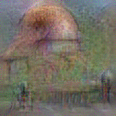
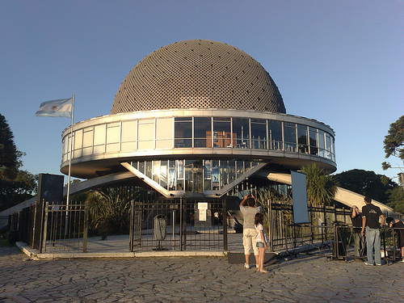
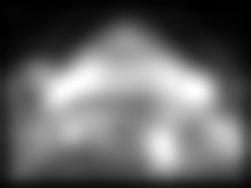

# Visual Language Modeling on CNN Image Representations

## Authors
* [Hiroharu Kato (The University of Tokyo)](http://hiroharu-kato.com/)
* [Tatsuya Harada (The University of Tokyo)](http://www.isi.imi.i.u-tokyo.ac.jp/~harada/)

## Abstract
  Measuring the naturalness of images is important to generate realistic images or to detect unnatural regions in images. Additionally, a method to measure naturalness can be complementary to Convolutional Neural Network (CNN) based features, which are known to be insensitive to the naturalness of images. However, most probabilistic image models have insufficient capability of modeling the complex and abstract naturalness that we feel because they are built directly on raw image pixels. In this work, we assume that naturalness can be measured by the predictability on high-level features during eye movement. Based on this assumption, we propose a novel method to evaluate the naturalness by building a variant of Recurrent Neural Network Language Models on pre-trained CNN representations. Our method is applied to two tasks, demonstrating that 1) using our method as a regularizer enables us to generate more understandable images from image features than existing approaches, and 2) unnaturalness maps produced by our method achieve state-of-the-art eye fixation prediction performance on two well-studied datasets.

## Example

### Image reconstruction

#### Original image


#### Reconstructed image from the fc7 feature of AlexNet (1000 dims)



### Saliency map

#### Original image


#### Saliency map from CNN-VLM of conv5_4 layer of VGGNet


## Full paper
  http://arxiv.org/abs/1511.02872

```tex
  @article{kato2015cnnvlm,
      author={Kato, Hiroharu and Harada, Tatsuya},
      title={Visual Language Modeling on CNN Image Representations},
      journal={arXiv preprint arXiv:1511.02872},
      year={2015}
  }
```

## Code

### Requirements
  * Python libraries
    * numpy
    * scipy
    * scikit-learn
    * theano
  * Other libraries
    * GPU and cudnn
    * Caffe\*
    * ImageMagick\*
  * Dataset
    * ILSVRC2012 classification Dataset\*

\* not required for testing pre-trained models.

### Testing pre-trained models
```bash
python run_pretrained_model.py
```
This script downloads pre-trained CNN-VLM models of AlexNet / VGGNet and execute image reconstruction and compute saliency map. Loading pre-trained model takes tens of minutes and requires a lot of RAM.

Pre-trained models were compiled using CUDA 7.0 and CuDNN v3 for GTX 970 on Ubuntu 14.04.

### Training CNN-VLM
First, specify the path of ILSVRC2012 dataset in prepare_images.py. Then run
```bash
python run_all.py
```
This may take several days.

### Differences from the paper
* CNN-VLMs are trained on the validation set of ImageNet.
* The learning rate of a reconstructor is 2^20.
[](* Image feature is standardized before reconstruction.)

### Contact
* My website: http://hiroharu-kato.com/
* E-mail: hiroharu.kato.1989.10.13@gmail.com
